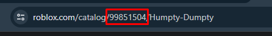

# IDs

Most of the buttons on the panel use IDs to allow you to insert stuff. To get an ID, open the item you want to wear in your browser and copy the numbers from the link. For example, if the link is `https://www.roblox.com/catalog/99851504/Humpty-Dumpty`, then the ID is `99851504`.

