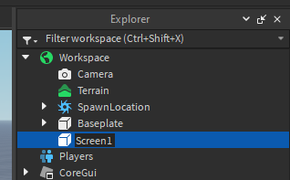
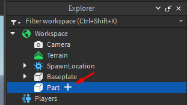
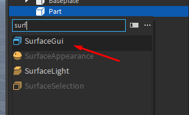
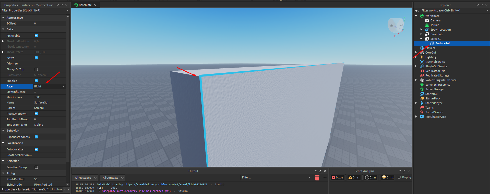
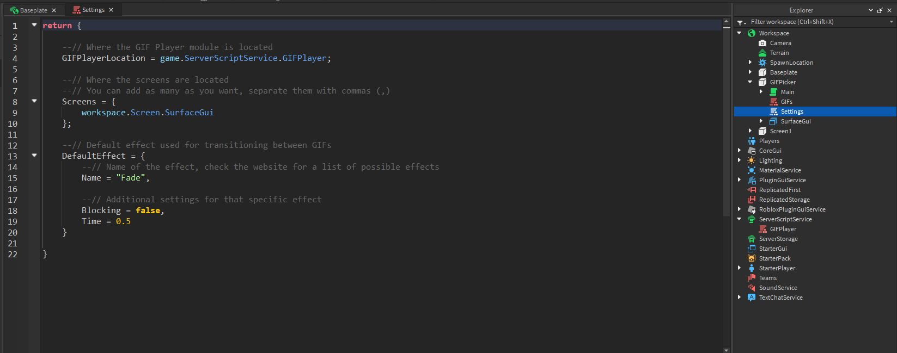

import YoutubeVideo from "@site/src/components/YoutubeVideo"

# Configuring the screens

Now that everything we need is inserted into the game, let's set up the screens.

## Creating the screens

This section expects that you already have the **parts** for your screens placed where you want them to be.

### Renaming screen parts

Make sure to name your screen parts so we can find them later using code. To rename them, select them in the `Explorer` window and press `F2` on your keyboard. Then insert a new name like `Screen1`



### Adding GUIs / Textures

First, insert `SurfaceGui`s or `Texture`s into your screen parts. To insert them, hover over the screen part in the `Explorer` window and click the (+) sign. Then select either `SurfaceGui` or `Texture` in the popup.

:::tip
`SurfaceGui`s should go into normal parts (blocks/bricks), `Texture`s should go into meshes, cylinders, spheres, unions, etc.
:::




### Changing GUI / Texture properties

We are not done yet. We have a GUI (or a texture) inserted into the part, but it might be facing in the wrong direction. To fix that, select the GUI / Texture and go to the `Properties` window (`View -> Properties` if you don't have it open). In the window scroll down to the `Face` property and change it until you can see a small blue (or orange for textures) outline on the side of your screen that's supposed to be the front.



Additionally, **if you're using GUIs**, it's a good idea to set the `LightInfluence` property right below the `Face` property to 0. This will make the GUI visible when it's dark.

## Configuring the settings

I added a second screen with a Texture:


Open the `Settings` script that's inside the panel part by double clicking on it in the `Explorer` window.



There are 3 settings: `GIFPlayerLocation`, `Screens` and `DefaultEffect`

-   `GIFPlayerLocation` tells the panel where the GIF Player is, the default setting is correct for us
-   `DefaultEffect` tells the player what effect to use, by default it's going to fade between GIFs. If you want to disable that change `Name = "Fade"` to `Name = "None"`
-   `Screens` tells the player where the screens are. Here's a more detailed explanation:

If you placed the GIF Player (module) into ServerScriptService, then you don't need to touch the `GIFPlayerLocation` and `DefaultEffect` settings at all.

The `Screens` setting is a table (a list) of locations to the screens you want to display the GIFs on. Each screen needs to be separated by a comma (`,`).

To get a location, start by writing `workspace`, which tells Roblox that you're looking inside of `Workspace` in the `Explorer` window. Look at the where the screen's GUI / Texture is in the `Explorer` window and every time you need to go into a model or a folder to get there, add a `.` and the name of the model / folder. Avoid putting spaces in the names of stuff if possible, they'll break this.

In my case, I have 2 screens (`Screen1` and `Screen2`), which are directly in `Workspace`. `Screen1` has a GUI and `Screen2` has a Texture, so for me the `Screens` setting looks like this:

```lua
Screens = { workspace.Screen1.SurfaceGui, workspace.Screen2.Texture };
```

If you want to add more screens just follow the pattern above.

## Video

Here's a video showing everything that happened on this page:

<YoutubeVideo id="zVbPT52V-aI" />
