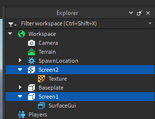

# Configuring the screens

Now that everything we need is inserted into the game, let's set up the screens.

## Inserting the screens

First, insert `SurfaceGui`s or `Texture`s into your screen parts. Make sure to name your screen parts so we can find it later.

:::tip
`SurfaceGui`s should go into normal parts (blocks/bricks), `Texture`s should go into meshes, cylinders, spheres, etc.
:::

:::tip
Set the `LightInfluence` property in your SurfaceGuis to 0 to make them glow in the dark.
:::

In my case, those are the screens I decided to use:



## Configuring the settings

Open the `Settings` script that's inside the panel part. There are 3 settings: `GIFPlayerLocation`, `Screens` and `DefaultEffect`

-   `GIFPlayerLocation` tells the panel where the GIF Player is, the default setting is correct for us
-   `DefaultEffect` tells the player what effect to use, by default it's going to fade between GIFs. If you want to disable that change `Name = "Fade"` to `Name = "None"`
-   `Screens` tells the player where the screens are. Here's a more detailed explanation:

The `Screens` setting is a table of the screens you want to display the GIFs on. Each sub-path of the location needs to be separated by a dot (`.`) and each location is separated by a comma (`,`). In our case we have 2 screens directly in Workspace so the setting looks like this:

```lua
Screens = { workspace.Screen1.SurfaceGui, workspace.Screen2.Texture };
```

If you want to add more screens just follow the pattern above.
