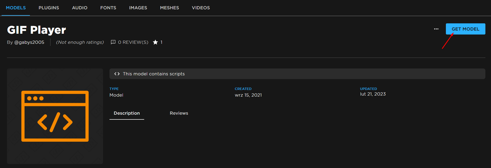
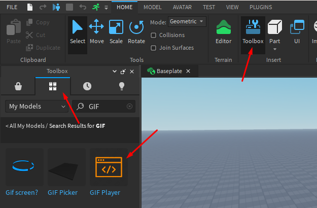
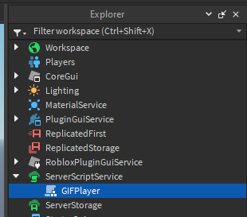

# Inserting the player and panel

## GIF Player

First we will insert the GIF **Player**. It's a **module** (a fancy script) responsible for actually playing the GIFs. It's interacted with by other scripts and doesn't do anything by itself.

Press the button below to get taken to the Roblox Marketplace page for the GIF Player. Then press `Get Model`.

<a href="https://create.roblox.com/marketplace/asset/7482594999" target="_blank" class="button button--primary">Roblox Marketplace</a>

Now open your game in Roblox Studio, open the **Toolbox** and insert the player from the library.

Open the **Explorer** window (View -> Explorer) and drag the script you just inserted into **ServerScriptService**.

:::note
I use [Vanilla](https://elttob.uk/go/vanilla) as my Studio icon pack, you probably have different icons.
:::

## GIF Panel

This panel will allow you to display GIFs on your screens in-game.

Press the button below to get taken to the Roblox Marketplace page for the GIF Panel. Then press `Get Model`.

<a href="https://create.roblox.com/marketplace/asset/7482597631" target="_blank" class="button button--primary">Roblox Marketplace</a>

Insert it into your game using the Toolbox, same as above. Drag it wherever you want it to be.
