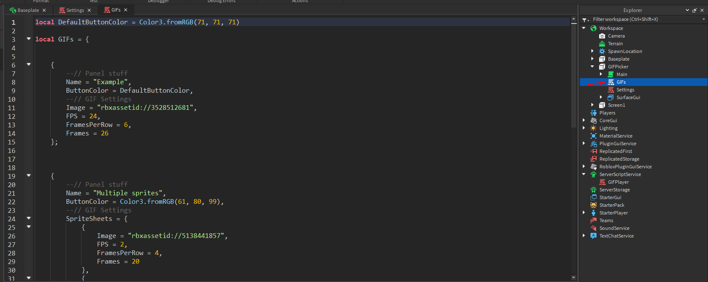
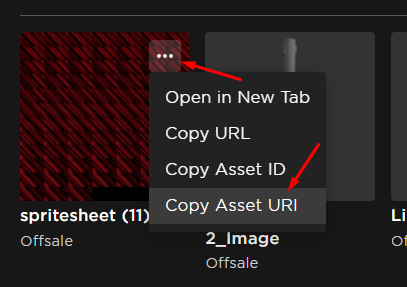

# Adding GIFs

**Roblox doesn't accept GIFs**, meaning that you need to convert them into **sprite sheets**. Sprite sheets are a collection of frames (individual images) of the GIF put together into a grid.

:::caution
Make sure your GIFs don't include anything that's against Roblox TOS, including links. Roblox WILL warn you for them.
:::

## Converting a GIF into a sprite sheet

:::note
If you uploaded a specific GIF to Roblox before, you can skip this section. You don't need to upload the same image multiple times.
:::

Use the window below to convert your GIFs to sprite sheets (or do it in a new tab by clicking [here](https://gabys.xyz/gif_to_sprite/)). First, select your GIF file in the field. Then you'll need to wait a few seconds while your computer converts it for you. When it's done you'll see the result sprite sheet, as well as some **important** info. Keep that info for later.

:::tip
Try keeping your GIFs under 100 frames (or less if they include text). Roblox will downscale the sprite sheet to 1024x1024 pixels, so a lot of quality will be lost.
:::

<iframe src="https://gabys.xyz/gif_to_sprite/" width="100%" height="500"></iframe>

Press the `Download sprite sheet` button to save it. Go to https://create.roblox.com/dashboard/creations?activeTab=Decal and upload the image you downloaded.

## Editing the GIFs script

After uploading the sprite sheet to Roblox, open the `GIFs` script that's inside of the panel part (the same way you opened the `Settings` script).



This script is responsible for generating the buttons on the panel and connecting them to the right GIFs. Each button on the panel is inside of the few lines of code between `{` and `}`. To add more buttons / GIFs, you need to copy one of the examples I left. Here's what 1 button looks like:

```lua
{
    --// Panel stuff
    Name = "Example",
    ButtonColor = DefaultButtonColor,
    --// GIF Settings
    Image = "rbxassetid://3528512681",
    FPS = 24,
    FramesPerRow = 6,
    Frames = 26
};
```

If you used the page above to convert your GIF, then click on the `Roblox module` view and copy everything below it, it's button code prepared specifically for your GIF. Paste it into the script below one of the examples. It'll look something like this:

```lua
{
    Name = "INSERT NAME OF BUTTON HERE",
    ButtonColor = DefaultButtonColor,
    Image = "INSERT IMAGE ID HERE AFTER UPLOADING",
    FPS = 10,
    FramesPerRow = 3,
    Frames = 7
};
```

Replace `INSERT NAME OF BUTTON HERE` with what you want to appear on the button. Make sure to keep the quotes (`""`), otherwise the script will break.

Go to https://create.roblox.com/dashboard/creations?activeTab=Image. Hover over the image you just uploaded and press the three dots that appear. Click `Copy Asset URI` and replace `INSERT IMAGE ID HERE AFTER UPLOADING` with what you just copied.



In the end that bit of code should look something like this:

```lua
{
    Name = "Set Fire",
    ButtonColor = DefaultButtonColor,
    Image = "rbxassetid://8672078232",
    FPS = 24,
    FramesPerRow = 5,
    Frames = 36
};
```

And that's everything that's required to insert the GIF into Roblox. I know it looks like a lot but after some practice you can insert new GIFs really quickly.
